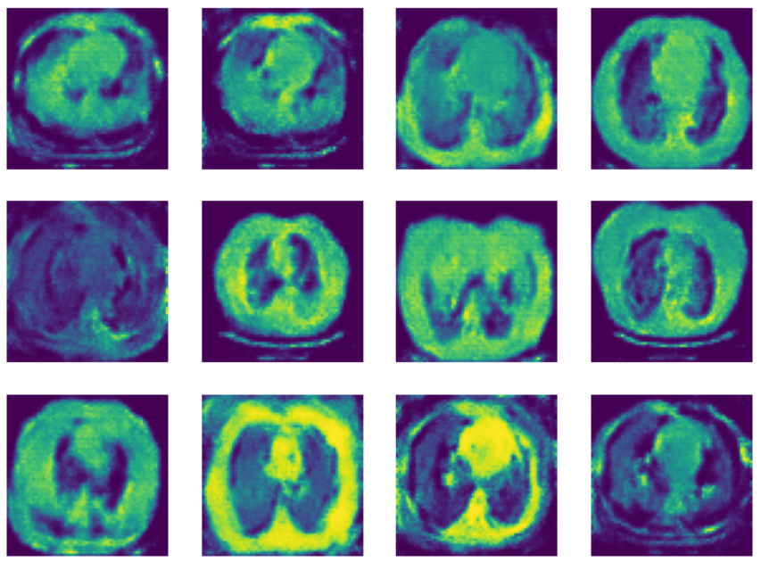

<h1 align="center">🧠 GAN for Chest CT Scan Generation</h1>
<p align="center">
  
  
  
</p>

## 🩺 Overview

This project implements a **Generative Adversarial Network (GAN)** to generate synthetic **chest CT scan images**. The GAN is trained on a dataset of medical images, demonstrating how AI can be used to simulate realistic medical data for augmentation or research purposes.

---

## 🧠 GAN Architecture

### 🧾 Discriminator
- Conv2D layers with increasing depth: 64 → 512
- Activation: LeakyReLU
- Regularization: Dropout, BatchNorm
- Output: Sigmoid (real/fake probability)

### 🪄 Generator
- ConvTranspose2D layers (reverse of discriminator)
- Activation: ReLU, Tanh at output
- Input: 100D random noise vector

---

## 🛠️ Setup & Installation

### 🔧 Requirements

Install dependencies with:

```bash
pip install torch torchvision matplotlib
```
### 📁 Dataset
The model uses grayscale CT scan images from:
<p align="center">
  <a href="https://www.kaggle.com/datasets/mohamedhanyyy/chest-ctscan-images" target="_blank">
    
  </a>
</p>
---
### 🎨 Sample Output

<p align="center">  </p>
